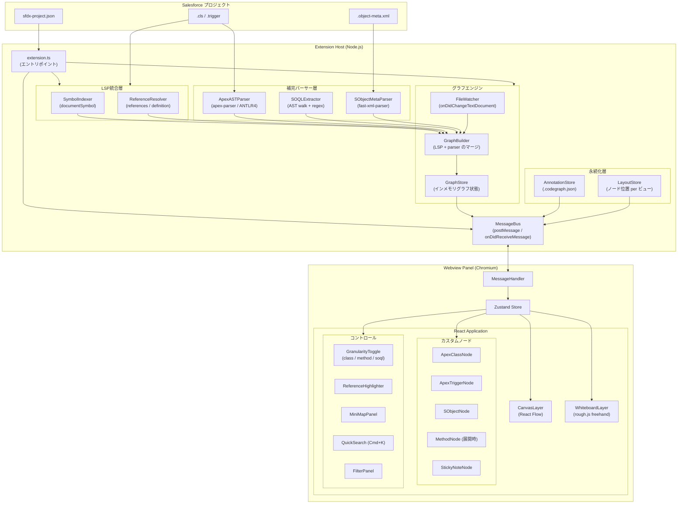
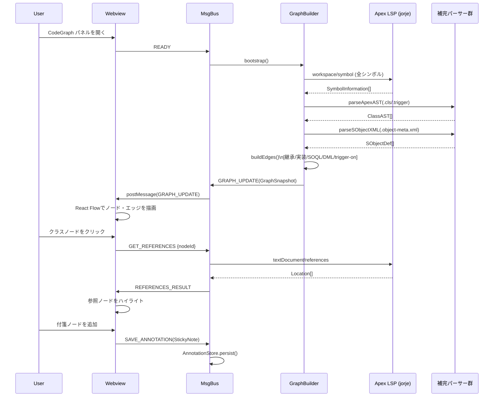

# CodeGraph — Salesforce Apex/SObject 可視化ツール 設計ドキュメント

## 目次

1. [プラットフォーム選定](#1-プラットフォーム選定)
2. [システムアーキテクチャ](#2-システムアーキテクチャ)
3. [技術スタック選定](#3-技術スタック選定)
4. [データモデル定義](#4-データモデル定義)
5. [画面・UX設計](#5-画面ux設計)
6. [タスク分割](#6-タスク分割)
7. [MVP範囲定義](#7-mvp範囲定義)

---

## 1. プラットフォーム選定

### 結論: **VS Code拡張を採用**

### 比較表

| 評価軸 | VS Code拡張 | Webアプリ（ローカルサーバ） |
|---|---|---|
| **LSPアクセス** | ◎ Public APIで即利用可能 | △ jorjeを独自起動、Java管理が必要 |
| **UI自由度** | ○ Webview = 完全Chromium環境 | ◎ 制限なし |
| **ファイルシステム** | ○ `vscode.workspace.fs` | ◎ Node `fs` 直接 |
| **認証・SFDX連携** | ◎ SFDX CLI文脈を継承 | △ 独自設定が必要 |
| **配布** | ○ `.vsix` / Marketplace | ○ npm / バイナリ |
| **プロセス複雑度** | ◎ 拡張ホスト + Webview の2層 | △ Webサーバ + LSPブリッジ + UI の3層 |

### 選定理由

Salesforce Extensions for VS Code はインストール済み環境で Apex Language Server（jorje）をすでに起動している。VS Code拡張からは `vscode.commands.executeCommand` という Public API でそのLSPにルーティングできるため、Language Serverの起動・管理コストがゼロになる。

```ts
// LSPへのアクセス例（Public API 経由）
const symbols = await vscode.commands.executeCommand<vscode.SymbolInformation[]>(
  'vscode.executeWorkspaceSymbolProvider',
  query
);
const refs = await vscode.commands.executeCommand<vscode.Location[]>(
  'vscode.executeReferenceProvider',
  uri,
  position
);
```

WebviewはフルChromium環境なのでUI制約は実質ゼロ。Webアプリのメリット（UI自由度）はVS Code拡張でも同等に得られる。

---

## 2. システムアーキテクチャ

### コンポーネント図



### データフロー（シーケンス図）



---

## 3. 技術スタック選定

### 拡張ホスト

| 技術 | 採用理由 |
|---|---|
| **TypeScript** | VS Code拡張の標準。LSPプロトコル型定義と完全一致 |
| **vscode-languageclient** | jorjeへのJSON-RPC接続管理。公式npm |
| **apex-parser** (`@apexdevtools/apex-parser`) | ANTLR4ベースのApex文法。SOQLクエリ・DML操作の抽出に使用 |
| **fast-xml-parser** | `.object-meta.xml` の高速・軽量な解析 |

### Webview（React アプリ）

| 技術 | 採用理由 |
|---|---|
| **React 18** | カスタムノード = Reactコンポーネントという自然なモデル |
| **React Flow (xyflow)** | 後述の比較で最適と判断 |
| **Zustand** | Canvas重アプリで不要な再レンダリングを最小化。Reduxは過剰 |
| **@dagrejs/dagre** | 初期自動レイアウト（LR/TB切り替え） |
| **rough.js** | フリーハンドアノテーションの手書き風描画 |
| **Vite** | Webviewバンドルの高速ビルド・HMR |

### 可視化ライブラリ比較

| ライブラリ | 長所 | 短所 | 判定 |
|---|---|---|---|
| **React Flow** | React ネイティブ。カスタムノード = Reactコンポーネント。pan/zoom/選択が組み込み。MiniMap・Backgroundも付属 | グラフアルゴリズム非内蔵（Dagre別途） | **採用** |
| Cytoscape.js | グラフアルゴリズム充実。大規模グラフ（1000+ノード）向け | Reactと相性が悪い（ref経由の命令型API）。スタイリングが煩雑 | 大規模時の代替候補 |
| D3.js force | 最大の柔軟性。フォースシミュレーション | React の DOM 管理と競合。pan/zoom の自前実装コストが高い | 不採用 |

React Flowを採用する決定的な理由: カスタムノードが純粋なReactコンポーネントとして書けるため、`ApexClassNode` は単なるスタイル付きdivになる。Dagreとの統合も`@xyflow/react`のドキュメントに例示されており、学習コストが最小。

---

## 4. データモデル定義

### 共有型定義 (`src/shared/types.ts`)

```typescript
// ============================================================
// プリミティブ
// ============================================================

export interface LSPRange {
  start: { line: number; character: number };
  end:   { line: number; character: number };
}

export interface XYPosition {
  x: number;
  y: number;
}

export interface Viewport {
  x: number;
  y: number;
  zoom: number;
}

// ============================================================
// ノード種別・エッジ種別
// ============================================================

export type NodeKind =
  | 'apex-class'
  | 'apex-interface'
  | 'apex-enum'
  | 'apex-trigger'
  | 'apex-method'
  | 'apex-constructor'
  | 'sobject'
  | 'sobject-field';

export type EdgeKind =
  | 'inherits'          // class extends class
  | 'implements'        // class implements interface
  | 'calls'             // メソッド → メソッド
  | 'soql-references'   // メソッド → SObject（SOQL）
  | 'dml-insert'        // DML: insert / upsert
  | 'dml-update'
  | 'dml-delete'
  | 'field-lookup'      // SObjectフィールド → SObject（Lookup/MD）
  | 'instantiates'      // new ClassName()
  | 'trigger-on'        // trigger fires on SObject
  | 'annotation-attach';// アノテーション付箋 → ノード

export type GranularityLevel = 'class' | 'method' | 'soql';

// ============================================================
// Apex ノード
// ============================================================

export interface ApexClassNode {
  id: string;                      // 例: "cls:AccountService"
  kind: 'apex-class' | 'apex-interface' | 'apex-enum';
  label: string;                   // クラス名
  fullyQualifiedName: string;      // namespace.ClassName
  uri: string;                     // ファイルパス
  range: LSPRange;
  namespace?: string;              // マネージドパッケージのnamespace
  isAbstract: boolean;
  isVirtual: boolean;
  accessModifier: 'public' | 'private' | 'global' | 'protected';
  annotations: ApexAnnotation[];   // @AuraEnabled, @InvocableMethod など
  methods: ApexMethodNode[];       // Methodレベル粒度で展開
  innerClasses: string[];          // 内部クラスのノードID
  isTestClass: boolean;
  sharingMode?: 'with sharing' | 'without sharing' | 'inherited sharing';
}

export interface ApexMethodNode {
  id: string;                      // 例: "method:AccountService.getAccounts"
  kind: 'apex-method' | 'apex-constructor';
  label: string;
  parentClassId: string;
  uri: string;
  range: LSPRange;
  returnType: string;
  parameters: ApexParameter[];
  accessModifier: 'public' | 'private' | 'global' | 'protected';
  isStatic: boolean;
  annotations: ApexAnnotation[];
  soqlQueries: SOQLQuery[];        // メソッド本体から抽出
  dmlOperations: DMLOperation[];
}

export interface ApexTriggerNode {
  id: string;                      // 例: "trigger:AccountTrigger"
  kind: 'apex-trigger';
  label: string;
  uri: string;
  range: LSPRange;
  targetSObject: string;           // SObject API名
  events: TriggerEvent[];
}

export interface ApexParameter {
  name: string;
  type: string;
}

export interface ApexAnnotation {
  name: string;                    // 'AuraEnabled', 'InvocableMethod' など
  parameters?: Record<string, string>;
}

export type TriggerEvent =
  | 'before insert' | 'before update' | 'before delete'
  | 'after insert'  | 'after update'  | 'after delete'
  | 'after undelete';

// ============================================================
// SObject ノード
// ============================================================

export interface SObjectNode {
  id: string;                      // 例: "sobject:Account"
  kind: 'sobject';
  label: string;                   // API名 (Account, MyObject__c)
  isCustom: boolean;
  isCustomMetadata: boolean;       // __mdt サフィックス
  uri?: string;                    // .object-meta.xml のパス（標準オブジェクトはundefined）
  fields: SObjectFieldNode[];      // SObjectレベル粒度で展開
  recordTypes: string[];
}

export interface SObjectFieldNode {
  id: string;                      // 例: "field:Account.Name"
  kind: 'sobject-field';
  label: string;
  apiName: string;
  parentSObjectId: string;
  fieldType: SalesforceFieldType;
  referenceTo?: string[];          // Lookup/MDの参照先SObject API名
  relationshipName?: string;
  required: boolean;
  externalId: boolean;
}

export type SalesforceFieldType =
  | 'Text' | 'Number' | 'Currency' | 'Date' | 'DateTime' | 'Boolean'
  | 'Picklist' | 'MultiPicklist' | 'TextArea' | 'LongTextArea' | 'RichTextArea'
  | 'Lookup' | 'MasterDetail' | 'ExternalLookup' | 'HierarchyLookup'
  | 'Email' | 'Phone' | 'Url' | 'Id' | 'Formula' | 'Rollup'
  | 'EncryptedText' | 'AutoNumber';

// ============================================================
// SOQL・DML抽出結果
// ============================================================

export interface SOQLQuery {
  raw: string;                     // SOQLクエリ文字列全体
  fromObject: string;              // FROM句のメインオブジェクト
  additionalObjects: string[];     // サブクエリ等で追加参照されるオブジェクト
  fields: string[];                // SELECT句のフィールド一覧
  hasSubquery: boolean;
  range: LSPRange;                 // メソッド内の位置
}

export interface DMLOperation {
  type: 'insert' | 'update' | 'upsert' | 'delete' | 'undelete' | 'merge';
  targetType: string;              // 操作対象SObject型名
  range: LSPRange;
}

// ============================================================
// エッジ
// ============================================================

export interface GraphEdge {
  id: string;
  kind: EdgeKind;
  sourceId: string;
  targetId: string;
  label?: string;
  metadata?: EdgeMetadata;
}

export interface EdgeMetadata {
  callSites?: LSPRange[];          // 'calls' エッジ用
  soqlQuery?: SOQLQuery;           // 'soql-references' エッジ用
  dmlOp?: DMLOperation;           // 'dml-*' エッジ用
  relationshipName?: string;       // 'field-lookup' エッジ用
}

// ============================================================
// ホワイトボード / アノテーション
// ============================================================

export type AnnotationKind = 'sticky-note' | 'freehand-stroke' | 'label-pin';

export interface StickyNote {
  id: string;
  kind: 'sticky-note';
  content: string;                 // Markdownテキスト
  position: XYPosition;
  size: { width: number; height: number };
  color: StickyColor;
  attachedToNodeId?: string;       // ノードにピンした場合、ドラッグに追従
  createdAt: string;               // ISO 8601
  updatedAt: string;
}

export type StickyColor = 'yellow' | 'blue' | 'green' | 'pink' | 'orange';

export interface FreehandStroke {
  id: string;
  kind: 'freehand-stroke';
  points: XYPosition[];            // rough.js linearPath 用座標列
  color: string;
  strokeWidth: number;
  roughness: number;               // rough.js roughness パラメータ
}

export interface LabelPin {
  id: string;
  kind: 'label-pin';
  text: string;
  attachedToNodeId: string;
  offset: XYPosition;             // ノード中心からのオフセット
}

export type Annotation = StickyNote | FreehandStroke | LabelPin;

// ============================================================
// ビュー状態
// ============================================================

export interface ViewState {
  granularity: GranularityLevel;
  viewport: Viewport;
  selectedNodeIds: string[];
  highlightedEdgeIds: string[];
  activeFilters: NodeFilter;
  layoutAlgorithm: 'dagre-lr' | 'dagre-tb' | 'manual';
}

export interface NodeFilter {
  hideTestClasses: boolean;
  hideManagedPackages: boolean;
  sobjectTypes: 'all' | 'custom-only' | 'referenced-only';
  minConnectionCount: number;      // これ未満のエッジ数のノードを非表示
}

// ============================================================
// グラフスナップショット（MessageBus経由で転送）
// ============================================================

export type GraphNode =
  | ApexClassNode
  | ApexMethodNode
  | ApexTriggerNode
  | SObjectNode
  | SObjectFieldNode;

export interface GraphSnapshot {
  version: number;
  projectRoot: string;
  nodes: GraphNode[];
  edges: GraphEdge[];
  annotations: Annotation[];
  layoutState: Record<string, XYPosition>; // nodeId → position
  viewState: ViewState;
}

// ============================================================
// MessageBus プロトコル（拡張ホスト ↔ Webview）
// ============================================================

export type ExtensionToWebviewMessage =
  | { type: 'GRAPH_UPDATE';      payload: GraphSnapshot }
  | { type: 'REFERENCES_RESULT'; payload: { nodeId: string; locations: LSPRange[] } }
  | { type: 'DEFINITION_RESULT'; payload: { uri: string; range: LSPRange } }
  | { type: 'PROGRESS';          payload: { stage: string; percent: number } }
  | { type: 'ERROR';             payload: { message: string; code: string } };

export type WebviewToExtensionMessage =
  | { type: 'READY' }
  | { type: 'GET_REFERENCES'; payload: { nodeId: string } }
  | { type: 'GET_DEFINITION';  payload: { nodeId: string } }
  | { type: 'OPEN_FILE';       payload: { uri: string; range: LSPRange } }
  | { type: 'SAVE_ANNOTATION'; payload: Annotation }
  | { type: 'DELETE_ANNOTATION'; payload: { annotationId: string } }
  | { type: 'SAVE_LAYOUT';     payload: { positions: Record<string, XYPosition> } }
  | { type: 'REFRESH_GRAPH' };
```

---

## 5. 画面・UX設計

### 5.1 粒度切り替え（セマンティックズーム）

React Flowのカメラズームとは別に、**意味的な粒度**をトグルで切り替える。

```
[Class] ──── [Method] ──── [SOQL]
  ↑              ↑              ↑
  全体像      内部構造      クエリ詳細
```

**Class Level（デフォルト）**
- 各ノード = クラス/SObjectのサマリーカード
- バッジ: "12 methods · 3 SOQL" などを表示
- エッジ: 継承・implements・trigger-on・クラス間DML/SOQL参照
- 想定ノード数: 20〜100

**Method Level**
- クラスノードをダブルクリックで展開
- React Flow の `parentId` を使いネストサブグラフを描画
- 展開後のエッジ: クロスクラスのメソッド呼び出しも表示
- 他クラスは折りたたみのまま維持

**SOQL Level**
- メソッドノードをダブルクリックで展開
- SOQLクエリボックス・DML操作ボックスがインライン表示
- SOQLノード → SObjectノードへのエッジ（フィールドも表示可）
- 「データベースクエリビュー」として使用

粒度変更の実装: `granularity` が変わると各ノードは `type` prop（collapsed/expanded）を再評価し、React Flowが `fitView({ duration: 600 })` でアニメーション遷移する。

### 5.2 参照ハイライト

```
クリック → references取得 → 参照ノード強調 → ESCで解除
```

1. ノードをクリック → `GET_REFERENCES` を送信
2. `textDocument/references` の結果 `Location[]` を受信
3. 各LocationをグラフインデックスでnodeIdに変換（uri + range → nodeId）
4. ハイライト適用:
   - 参照元ノード: オレンジのリング、z-index 上昇
   - 非参照ノード: opacity 20%にディム（CSS filter）
   - 選択ノード → 参照元ノードへ: アンバーの点線エッジ
5. ESCキーまたは背景クリックで全解除

ノードタイトルクリック → `OPEN_FILE` → `vscode.window.showTextDocument` でエディタの対象行に遷移。

### 5.3 ホワイトボード

**付箋ノード (StickyNoteNode)**
- React Flowカスタムノード（`type: 'sticky'`）
- ハンドルなし、ドラッグ可、ズーム追従
- `attachedToNodeId` が設定された場合、ターゲットノードのドラッグに追従
- コンテンツは `<textarea>` でMarkdown入力（auto-resize）
- 右クリックメニュー: 「ノードにピン」「色変更」「削除」

**フリーハンド描画**
- `D` キーで描画モードに切り替え
- マウスイベントを rough.js の `linearPath` に蓄積
- mouseup でストロークを `FreehandStroke` として保存
- SVGパスとしてReact Flow上に描画（canvas レイヤーを背景に配置）

**ラベルピン (LabelPin)**
- 付箋ノードを右クリック → 「ノードにピン」→ ターゲットノードをクリック
- `annotation-attach` エッジ（点線）で接続を可視化

### 5.4 レイアウト・ナビゲーション

| 機能 | 実装 |
|---|---|
| 初期自動レイアウト | Dagre LR（継承ヒエラルキー）/ TB（データフロー） |
| 手動オーバーライド | 位置を即座に `LayoutStore` に永続化 |
| MiniMap | React Flow 組み込みの `<MiniMap>`（ノード種別で色分け） |
| クイック検索 | `Cmd/Ctrl+K` でフローティング検索バー。選択で `fitView` |
| フィルターパネル | テストクラス非表示・マネージドパッケージ非表示・SObjectタイプ絞り込み |

### 5.5 永続化

- アノテーション・レイアウトはワークスペースルートの `.codegraph.json` に保存
- チームでの共有のためgitにコミット推奨（`.gitignore` に例外追加）

```json
// .codegraph.json の構造例
{
  "version": 1,
  "annotations": [...],
  "layouts": {
    "class": { "cls:AccountService": { "x": 100, "y": 200 } },
    "method": {}
  }
}
```

---

## 6. タスク分割

### Phase 0: プロジェクトスキャフォールド（4日）

| タスク | 工数 | 依存 |
|---|---|---|
| VS Code拡張ボイラープレート生成（`yo code`）、TypeScript設定 | 0.5d | — |
| Vite + React Webviewビルドパイプライン（HMR対応） | 1d | — |
| 拡張ホスト ↔ Webview MessageBusスケルトン（型付き） | 0.5d | — |
| React Flow基本キャンバス（ハードコードテストノードで動作確認） | 1d | MsgBus |
| Zustandストアスケルトン（nodes / edges / viewState スライス） | 0.5d | React Flow |
| ESLint・Prettier・TypeScript strict modeのCI設定 | 0.5d | — |

**成果物**: パネルを開くとドラッグ可能なテストグラフが表示される拡張

---

### Phase 1: LSP統合（8日）

| タスク | 工数 | 依存 |
|---|---|---|
| Salesforce拡張のLanguage Clientを検出、`executeCommand` ラッパー実装 | 1d | Ph0 |
| `workspace/symbol` で全Apexシンボルをインデックス | 1.5d | LSP接続 |
| `textDocument/documentSymbol` をファイル単位で取得 | 1.5d | LSP接続 |
| シンボルから `ApexClassNode` / `ApexMethodNode` を構築 | 1d | シンボルインデクサ |
| `textDocument/references` でクリックハイライト実装 | 1.5d | シンボルインデクサ |
| `textDocument/definition` → ファイルを開く | 0.5d | LSP接続 |
| `FileWatcher` でファイル保存時のインクリメンタル更新 | 1d | GraphStore |

**リスク対処**: jorjeへの直接LanguageClient接続がVS Code拡張分離でブロックされた場合は `vscode.executeWorkspaceSymbolProvider` などのPublic APIにフォールバック。

**成果物**: 実ワークスペースの全Apexクラスがノード表示され、参照ハイライトが動作する

---

### Phase 2: 補完パーサー（7日）

| タスク | 工数 | 依存 |
|---|---|---|
| `apex-parser` ANTLR文法の統合（TypeScriptターゲット） | 1.5d | Ph0 |
| メソッド本体からのSOQLクエリ抽出（AST walk + regex） | 1.5d | apex-parser |
| DML操作（insert/update/delete等）の抽出 | 1d | apex-parser |
| `fast-xml-parser` で `.object-meta.xml` を解析 | 1d | Ph0 |
| `SObjectNode` 構築（フィールド・リレーションシップ） | 1.5d | XMLパーサー |
| Lookup/Master-Detailエッジビルダー | 0.5d | SObjectNode |

**SOQL抽出の軽量アプローチ（MVP向け）**:
```ts
// ANTLRフルパース前の高速フォールバック
const SOQL_REGEX = /\[\s*SELECT\s+.+?\s+FROM\s+(\w+)/gis;
```

**成果物**: SObjectがフィールド・リレーション付きで表示。ApexからSObjectへのDML/SOQLエッジが描画される

---

### Phase 3: 可視化ポリッシュ（8日）

| タスク | 工数 | 依存 |
|---|---|---|
| `ApexClassNode` カスタムReactコンポーネント | 1d | Ph1 |
| `SObjectNode` カスタムReactコンポーネント | 1d | Ph2 |
| `ApexTriggerNode` カスタムReactコンポーネント | 0.5d | Ph1 |
| メソッドサブグラフ展開（ダブルクリックで in-place 展開） | 2d | Ph2 |
| 粒度トグル（class / method / soql）の状態管理と遷移アニメーション | 1.5d | メソッド展開 |
| Dagre自動レイアウト統合（`@dagrejs/dagre`） | 1d | Ph3ノード |
| エッジ種別スタイリング（実線/点線/色をEdgeKindで制御） | 1d | 全エッジ |

**成果物**: 3段階粒度切り替えとスタイル付きノード・エッジの完全動作

---

### Phase 4: ホワイトボード機能（7日）

| タスク | 工数 | 依存 |
|---|---|---|
| `StickyNoteNode` カスタムReactコンポーネント | 1.5d | Ph3 |
| 付箋ノードアタッチ（`attachedToNodeId` + 追従ドラッグ） | 1d | StickyNote |
| フリーハンド描画キャンバス（rough.js + Dキーでモード切替） | 2d | Ph3 |
| `.codegraph.json` へのアノテーション永続化 | 1d | Ph4 |
| アノテーションのシリアライズ・デシリアライズ | 0.5d | 永続化 |
| 右クリックコンテキストメニュー（ピン・削除・色変更） | 1d | StickyNote |

**成果物**: 永続化付きホワイトボードが完全動作

---

### Phase 5: UXリファイン（5日）

| タスク | 工数 | 依存 |
|---|---|---|
| クイック検索（`Cmd+K`）+ `fitView` 遷移 | 1d | Ph3 |
| フィルターパネル（テストクラス非表示・マネージドパッケージ非表示等） | 1.5d | Ph3 |
| 参照ハイライトの opacity ディムオーバーレイ | 1d | Ph1 |
| レイアウト永続化（粒度ごと） | 0.5d | LayoutStore |
| 大規模グラフのパフォーマンス対策（200+ノード時のノードカリング） | 1d | Ph3 |

---

### 工数サマリー

| フェーズ | 工数 |
|---|---|
| Phase 0 スキャフォールド | 4日 |
| Phase 1 LSP統合 | 8日 |
| Phase 2 補完パーサー | 7日 |
| Phase 3 可視化ポリッシュ | 8日 |
| Phase 4 ホワイトボード | 7日 |
| Phase 5 UXリファイン | 5日 |
| **合計** | **39日（ソロ 約8週間）** |

---

## 7. MVP範囲定義

**MVPの問い**: 「Apexクラスと SObject の繋がりを俯瞰し、メモを残せるか？」

### MVP に含む（Phase 0〜2 + Phase 3コア）

- ワークスペーススキャン → 全Apexクラス・SObjectをノード表示
- エッジ: 継承・implements・trigger-on・DML/SOQL参照（**クラスレベルのみ**）
- クリック → 参照ノードをハイライト（opacity ディム付き）
- ノードタイトルクリック → エディタの対象行へジャンプ
- 付箋ノード（フリーハンドなし）
- Dagre初期自動レイアウト・ドラッグ・位置永続化
- テストクラス非表示トグル

**MVP想定期間: 4週間**（Phase 0, 1, 2 + Phase 3のノード描画部分）

### MVP から除外（後フェーズ）

- メソッドレベル展開・SOQLレベルビュー
- フリーハンド描画
- ノードへのアノテーションピン
- クイック検索・詳細フィルターパネル
- SObjectフィールドレベル詳細

---

## 付録: プロジェクト構成（参考）

```
codegraph/
├── src/
│   ├── extension/          # 拡張ホスト (Node.js)
│   │   ├── extension.ts    # エントリポイント・アクティベーション
│   │   ├── graph/
│   │   │   ├── GraphBuilder.ts
│   │   │   └── GraphStore.ts
│   │   ├── lsp/
│   │   │   ├── SymbolIndexer.ts
│   │   │   └── ReferenceResolver.ts
│   │   ├── parser/
│   │   │   ├── ApexASTParser.ts
│   │   │   ├── SOQLExtractor.ts
│   │   │   └── SObjectMetaParser.ts
│   │   └── persistence/
│   │       ├── AnnotationStore.ts
│   │       └── LayoutStore.ts
│   ├── webview/            # React アプリ (Chromium)
│   │   ├── main.tsx
│   │   ├── store/
│   │   │   └── graphStore.ts  # Zustand
│   │   ├── components/
│   │   │   ├── canvas/
│   │   │   │   └── CodeGraphCanvas.tsx
│   │   │   ├── nodes/
│   │   │   │   ├── ApexClassNode.tsx
│   │   │   │   ├── SObjectNode.tsx
│   │   │   │   ├── ApexTriggerNode.tsx
│   │   │   │   └── StickyNoteNode.tsx
│   │   │   ├── controls/
│   │   │   │   ├── GranularityToggle.tsx
│   │   │   │   └── FilterPanel.tsx
│   │   │   └── whiteboard/
│   │   │       └── FreehandLayer.tsx
│   │   └── MessageHandler.ts
│   └── shared/
│       └── types.ts        # 全型定義（拡張ホスト・Webview共有）
├── .codegraph.json         # アノテーション・レイアウト永続化（git管理推奨）
├── package.json
├── tsconfig.json
└── vite.config.ts
```

---

## 付録: Namespace・マネージドパッケージの扱い

マネージドパッケージのApexクラスは `namespace__ClassName` 形式。

- `ApexClassNode.namespace` に抽出したnamespaceを格納
- ラベル表示では namespace を省略し `ClassName` のみ表示
- フィルターパネルの「マネージドパッケージ非表示」は `namespace` の有無で判定
- `fullyQualifiedName` には完全名を保持し、LSP参照解決に使用

## 付録: 大規模Orgのパフォーマンス

実際のSalesforce Orgには 500〜2000 の Apex クラスが存在しうる。React Flowは ~1000ノードで性能劣化。

対策:
1. デフォルトフィルター: `sobjectTypes: 'referenced-only'`（Apex参照のあるSObjectのみ表示）
2. デフォルトフィルター: `hideTestClasses: true`
3. マネージドパッケージをNamespaceでグルーピング（React Flow `<NodeGroup>`）
4. ビューポート外ノードのカリング（React Flow `nodeExtent` + 仮想化）
