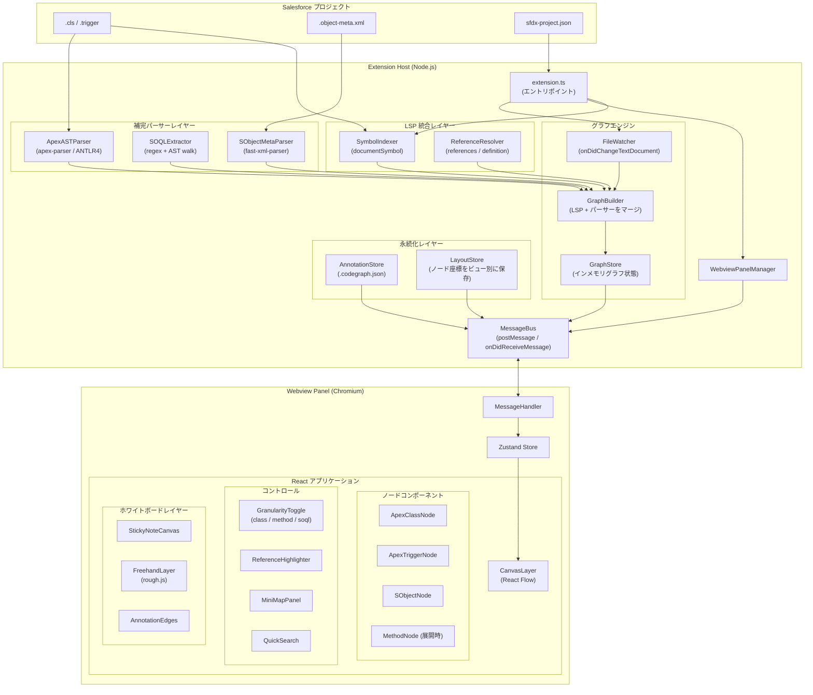
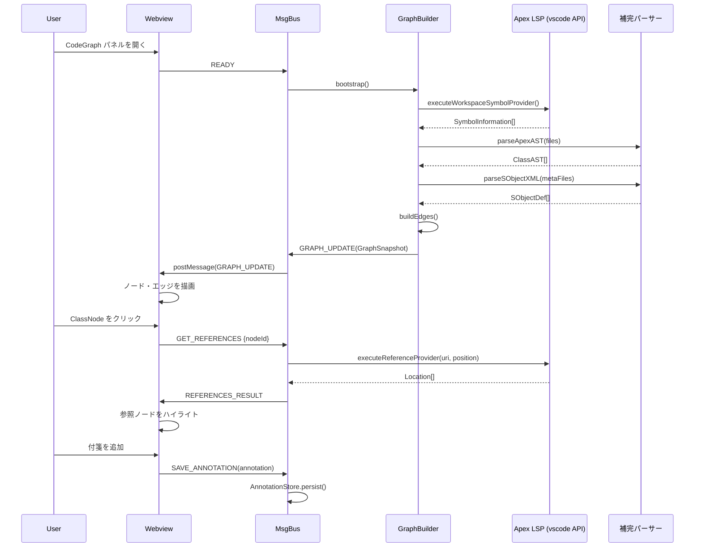
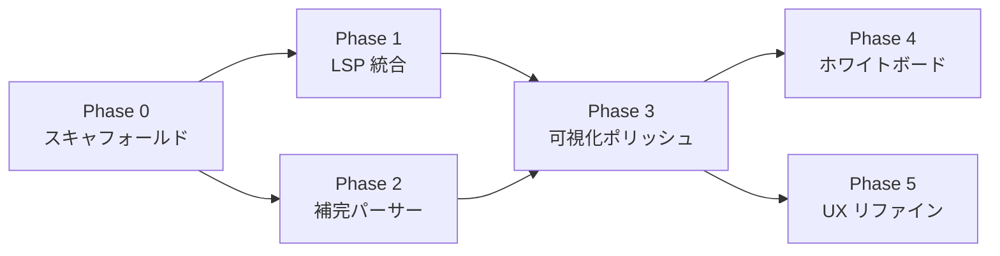

# CodeGraph: Salesforce Apex/SObject ビジュアライザー 設計ドキュメント

## 目次

1. [プラットフォーム選定](#1-プラットフォーム選定)
2. [システムアーキテクチャ](#2-システムアーキテクチャ)
3. [技術スタック選定](#3-技術スタック選定)
4. [データモデル定義](#4-データモデル定義)
5. [画面・UX設計](#5-画面ux設計)
6. [タスク分割](#6-タスク分割)
7. [MVP範囲定義](#7-mvp範囲定義)

---

## 1. プラットフォーム選定

### 結論: **VS Code 拡張を採用**

### 比較表

| 観点 | VS Code 拡張 | ローカル Web サーバ |
|---|---|---|
| Apex LSP アクセス | **◎** vscode API 経由で即利用可能 | △ 独自に jorje プロセスを起動・管理する必要あり |
| UI 自由度 | ◎ Webview = 完全な Chromium 環境 | ◎ 同等 |
| ファイルシステム | ◎ `vscode.workspace.fs` API | ◎ Node `fs` 直接 |
| 認証・SFDX コンテキスト | **◎** 既存セッションを継承 | × 独自管理が必要 |
| 配布 | ◎ `.vsix` / Marketplace | △ npm install + サーバ起動手順が必要 |
| 複雑度 | **低** | 高（LSP ブリッジが必要） |

### 決定理由

Salesforce Extensions for VS Code が既に Apex Language Server (jorje) を起動・管理している。  
VS Code 拡張からは以下の**パブリック API** を通じて LSP 機能を直接利用できる。

```typescript
// LSP を使わずとも VS Code API 経由でシンボル・参照を取得できる
vscode.commands.executeCommand<vscode.SymbolInformation[]>(
  'vscode.executeWorkspaceSymbolProvider', query
);
vscode.commands.executeCommand<vscode.Location[]>(
  'vscode.executeReferenceProvider', uri, position
);
```

Web アプリの場合、jorje のプロセス管理・Java ランタイム検出・LSP ワイヤプロトコルの実装が必要になり、複雑度が大幅に増す。VS Code の Webview は完全な Chromium 環境であるため UI 上の制約はない。

---

## 2. システムアーキテクチャ

### 全体構成



### データフロー（シーケンス）



---

## 3. 技術スタック選定

### Extension Host

| 技術 | 採用理由 |
|---|---|
| **TypeScript** | VS Code 拡張の標準。LSP プロトコル型定義と完全一致 |
| **vscode-languageclient** | jorje への JSON-RPC 接続を管理する公式ライブラリ |
| **apex-parser** (`@apexdevtools/apex-parser`) | ANTLR4 ベースの Apex 文法。SOQL・DML 抽出に使用 |
| **fast-xml-parser** | `.object-meta.xml` の軽量 JSON 変換 |

### Webview

| 技術 | 採用理由 |
|---|---|
| **React 18** | コンポーネントモデルがノード/エッジ構造に自然にマッチ |
| **React Flow** | カスタムノード = React コンポーネント。pan/zoom/selection を内蔵 |
| **Zustand** | Redux より軽量。Canvas 重アプリで再レンダリングを最小化 |
| **@dagrejs/dagre** | 初期自動配置（LR/TB レイアウト） |
| **rough.js** | 手書き風フリーハンドアノテーション |
| **Vite** | Webview バンドルの高速ビルド・HMR |

### 可視化ライブラリ比較

| ライブラリ | 強み | 弱み | 判定 |
|---|---|---|---|
| **React Flow** | React ネイティブ、カスタムノード容易、minimap・selection 内蔵 | グラフアルゴリズムは別途 dagre が必要 | **採用** |
| Cytoscape.js | グラフアルゴリズム豊富、大規模グラフに強い | React 非ネイティブ、命令型 API との統合が煩雑 | 不採用 |
| D3.js force | 最大の柔軟性 | DOM 操作が React と競合、pan/zoom の自前実装コストが高い | 不採用 |

---

## 4. データモデル定義

```typescript
// ============================================================
// 基本型
// ============================================================

export type NodeKind =
  | 'apex-class'
  | 'apex-interface'
  | 'apex-enum'
  | 'apex-trigger'
  | 'apex-method'
  | 'apex-constructor'
  | 'sobject'
  | 'sobject-field';

export type EdgeKind =
  | 'inherits'         // class extends class
  | 'implements'       // class implements interface
  | 'calls'            // method → method 呼び出し
  | 'soql-references'  // method が SObject を SOQL で参照
  | 'dml-insert'
  | 'dml-update'
  | 'dml-delete'
  | 'field-lookup'     // SObject フィールド → SObject (Lookup/MD)
  | 'instantiates'     // new ClassName()
  | 'trigger-on'       // trigger が SObject 上で発火
  | 'annotation-attach'; // 付箋がノードにピン留め

export type GranularityLevel = 'class' | 'method' | 'soql';

export interface LSPRange {
  start: { line: number; character: number };
  end:   { line: number; character: number };
}

export interface XYPosition {
  x: number;
  y: number;
}

export interface Viewport {
  x: number;
  y: number;
  zoom: number;
}

// ============================================================
// Apex ノード
// ============================================================

export interface ApexClassNode {
  id: string;                    // 例: "cls:AccountService"
  kind: 'apex-class' | 'apex-interface' | 'apex-enum';
  label: string;                 // クラス名（短縮）
  fullyQualifiedName: string;    // namespace.ClassName
  uri: string;                   // ファイルパス
  range: LSPRange;
  namespace?: string;            // マネージドパッケージ namespace
  isAbstract: boolean;
  isVirtual: boolean;
  accessModifier: 'public' | 'private' | 'global' | 'protected';
  annotations: ApexAnnotation[]; // @AuraEnabled, @InvocableMethod 等
  methods: ApexMethodNode[];     // method 粒度で展開時に使用
  innerClasses: string[];        // 内部クラスのノード ID
  isTestClass: boolean;
  sharingMode?: 'with sharing' | 'without sharing' | 'inherited sharing';
}

export interface ApexMethodNode {
  id: string;                    // 例: "method:AccountService.getAccounts"
  kind: 'apex-method' | 'apex-constructor';
  label: string;
  parentClassId: string;
  uri: string;
  range: LSPRange;
  returnType: string;
  parameters: ApexParameter[];
  accessModifier: 'public' | 'private' | 'global' | 'protected';
  isStatic: boolean;
  annotations: ApexAnnotation[];
  soqlQueries: SOQLQuery[];      // メソッド本体から抽出
  dmlOperations: DMLOperation[];
}

export interface ApexTriggerNode {
  id: string;                    // 例: "trigger:AccountTrigger"
  kind: 'apex-trigger';
  label: string;
  uri: string;
  range: LSPRange;
  targetSObject: string;         // SObject API 名
  events: TriggerEvent[];
}

export interface ApexParameter {
  name: string;
  type: string;
}

export interface ApexAnnotation {
  name: string;
  parameters?: Record<string, string>;
}

export type TriggerEvent =
  | 'before insert' | 'before update' | 'before delete'
  | 'after insert'  | 'after update'  | 'after delete'
  | 'after undelete';

// ============================================================
// SObject ノード
// ============================================================

export interface SObjectNode {
  id: string;                    // 例: "sobject:Account"
  kind: 'sobject';
  label: string;                 // API 名（Account, MyObject__c）
  isCustom: boolean;
  isCustomMetadata: boolean;     // __mdt サフィックス
  uri?: string;                  // .object-meta.xml のパス（標準オブジェクトは undefined）
  fields: SObjectFieldNode[];    // sobject 粒度で展開時に使用
  recordTypes: string[];
}

export interface SObjectFieldNode {
  id: string;                    // 例: "field:Account.Name"
  kind: 'sobject-field';
  label: string;
  apiName: string;
  parentSObjectId: string;
  fieldType: SalesforceFieldType;
  referenceTo?: string[];        // Lookup/MD の参照先 SObject API 名
  relationshipName?: string;
  required: boolean;
  externalId: boolean;
}

export type SalesforceFieldType =
  | 'Text' | 'Number' | 'Currency' | 'Date' | 'DateTime' | 'Boolean'
  | 'Picklist' | 'MultiPicklist' | 'TextArea' | 'LongTextArea' | 'RichTextArea'
  | 'Lookup' | 'MasterDetail' | 'ExternalLookup' | 'HierarchyLookup'
  | 'Email' | 'Phone' | 'Url' | 'Id' | 'Formula' | 'Rollup'
  | 'EncryptedText' | 'AutoNumber';

// ============================================================
// SOQL・DML 抽出結果
// ============================================================

export interface SOQLQuery {
  raw: string;                   // SOQL 全文
  fromObject: string;            // FROM 句のオブジェクト
  additionalObjects: string[];   // サブクエリ等で参照するオブジェクト
  fields: string[];              // SELECT フィールド一覧
  hasSubquery: boolean;
  range: LSPRange;               // メソッド内の位置
}

export interface DMLOperation {
  type: 'insert' | 'update' | 'upsert' | 'delete' | 'undelete' | 'merge';
  targetType: string;            // 操作対象の SObject 型
  range: LSPRange;
}

// ============================================================
// エッジ
// ============================================================

export interface GraphEdge {
  id: string;
  kind: EdgeKind;
  sourceId: string;
  targetId: string;
  label?: string;
  metadata?: EdgeMetadata;
}

export interface EdgeMetadata {
  callSites?: LSPRange[];        // 'calls' エッジ: 呼び出し箇所
  soqlQuery?: SOQLQuery;         // 'soql-references' エッジ
  dmlOp?: DMLOperation;          // 'dml-*' エッジ
  relationshipName?: string;     // 'field-lookup' エッジ
}

// ============================================================
// ホワイトボード・アノテーション
// ============================================================

export type AnnotationKind = 'sticky-note' | 'freehand-stroke' | 'label-pin';

export interface StickyNote {
  id: string;
  kind: 'sticky-note';
  content: string;               // Markdown テキスト
  position: XYPosition;
  size: { width: number; height: number };
  color: 'yellow' | 'blue' | 'green' | 'pink' | 'orange';
  attachedToNodeId?: string;     // ノードにピン留めすると追従ドラッグ
  createdAt: string;             // ISO 8601
  updatedAt: string;
}

export interface FreehandStroke {
  id: string;
  kind: 'freehand-stroke';
  points: XYPosition[];          // rough.js linearPath に渡す点列
  color: string;
  strokeWidth: number;
  roughness: number;             // rough.js の roughness パラメータ
}

export interface LabelPin {
  id: string;
  kind: 'label-pin';
  text: string;
  attachedToNodeId: string;
  offset: XYPosition;            // ノード中心からのオフセット
}

export type Annotation = StickyNote | FreehandStroke | LabelPin;

// ============================================================
// ビュー状態
// ============================================================

export interface ViewState {
  granularity: GranularityLevel;
  viewport: Viewport;
  selectedNodeIds: string[];
  highlightedEdgeIds: string[];
  activeFilters: NodeFilter;
  layoutAlgorithm: 'dagre-lr' | 'dagre-tb' | 'manual';
}

export interface NodeFilter {
  hideTestClasses: boolean;
  hideManagedPackages: boolean;
  sobjectTypes: 'all' | 'custom-only' | 'referenced-only';
  minConnectionCount: number;    // これ未満の接続数のノードを非表示
}

// ============================================================
// グラフスナップショット（MessageBus で送受信する全データ）
// ============================================================

export type GraphNode =
  | ApexClassNode
  | ApexMethodNode
  | ApexTriggerNode
  | SObjectNode
  | SObjectFieldNode;

export interface GraphSnapshot {
  version: number;
  projectRoot: string;
  nodes: GraphNode[];
  edges: GraphEdge[];
  annotations: Annotation[];
  layoutState: Record<string, XYPosition>; // nodeId → 座標
  viewState: ViewState;
}

// ============================================================
// MessageBus プロトコル（Extension Host ↔ Webview）
// ============================================================

export type ExtensionToWebviewMessage =
  | { type: 'GRAPH_UPDATE';      payload: GraphSnapshot }
  | { type: 'REFERENCES_RESULT'; payload: { nodeId: string; edgeIds: string[] } }
  | { type: 'DEFINITION_RESULT'; payload: { uri: string; range: LSPRange } }
  | { type: 'PROGRESS';          payload: { stage: string; percent: number } }
  | { type: 'ERROR';             payload: { message: string; code: string } };

export type WebviewToExtensionMessage =
  | { type: 'READY' }
  | { type: 'GET_REFERENCES'; payload: { nodeId: string } }
  | { type: 'GET_DEFINITION';  payload: { nodeId: string } }
  | { type: 'OPEN_FILE';       payload: { uri: string; range: LSPRange } }
  | { type: 'SAVE_ANNOTATION'; payload: Annotation }
  | { type: 'DELETE_ANNOTATION'; payload: { annotationId: string } }
  | { type: 'SAVE_LAYOUT';     payload: { positions: Record<string, XYPosition> } }
  | { type: 'REFRESH_GRAPH' };
```

---

## 5. 画面・UX設計

### 5.1 粒度切り替え（セマンティックズーム）

React Flow のズームとは別に、**意味レベル**でビューを切り替える。

```
[Class] ←→ [Method] ←→ [SOQL]
```

#### Class レベル（デフォルト）

- 各ノードはクラス名・アイコン（class/trigger/sobject）・サマリバッジ（例: "12 methods, 3 SOQL"）のカード
- エッジ: inherits, implements, trigger-on, DML/SOQL 参照（クラス間）
- 20〜100 ノード程度のヘリコプタービュー

#### Method レベル

- クラスノードをダブルクリックすると**その場で展開**し、子メソッドノードが表示される
- 他クラスは折りたたみ状態を維持
- React Flow の `parentId` によるサブグラフとして実装
- クロスクラスのメソッド呼び出しエッジも描画

#### SOQL レベル

- メソッドノードをダブルクリックすると展開
- SOQL クエリボックス・DML オペレーションボックスがインライン表示
- 参照する SObject ノードへのエッジを描画（フィールドレベルも選択可）

**遷移実装**: 粒度変更時に Zustand ストアの `granularity` を更新 → 各ノードが `type` プロパティを再評価（collapsed / expanded） → React Flow の `fitView({ duration: 600 })` でスムーズアニメーション

### 5.2 参照ハイライト

ノードをクリックした際のフロー:

1. `GET_REFERENCES` メッセージを Extension Host に送信
2. `vscode.commands.executeCommand('vscode.executeReferenceProvider', uri, position)` を実行
3. 返却された `Location[]` をノード ID に変換（uri + range → nodeId インデックスを使用）
4. 参照ノードに**オレンジのリング**と z-index 上昇を適用
5. 非参照ノードを**20% 不透明度**にディム（CSS filter）
6. 参照元 → 選択ノードへの**アンバー破線エッジ**を一時描画
7. Escape キーまたは背景クリックでハイライトをクリア

ノードタイトルクリックで `OPEN_FILE` メッセージ → `vscode.window.showTextDocument` で該当行を VS Code エディタで開く。

### 5.3 ホワイトボード

#### 付箋ノード（StickyNote）

- React Flow カスタムノード（`type: 'sticky'`）
- handles なし、ドラッグ可能・ズームに追従
- `attachedToNodeId` が設定されている場合、親ノードのドラッグに追従
- コンテンツは `<textarea>` with auto-resize（Markdown をそのまま保存）
- 右クリックメニュー: ピン留め / 色変更 / 削除

#### フリーハンド描画（FreehandStroke）

- `D` キーで描画モードに切り替え
- 背景キャンバスへのマウスイベントで `rough.js` の `linearPath` を蓄積
- mouseup 時に stroke を Annotation として保存、SVG foreign object として描画
- rough.js の `roughness` パラメータで手書き感を調整

#### アノテーションピン留め

- 付箋を右クリック → "ノードにピン留め" → 対象ノードをクリック
- `attachedToNodeId` をセット
- 付箋とノード間に破線エッジ（`type: 'annotation-attach'`）を表示

### 5.4 レイアウト・ナビゲーション

| 機能 | 実装 |
|---|---|
| 初期自動レイアウト | Dagre LR（継承階層）/ TB（データフロー） |
| 手動移動 | React Flow の draggable、即座にポジション保存 |
| ポジション永続化 | `.codegraph.json` にビュー別・粒度別で保存 |
| ミニマップ | React Flow 組み込み `<MiniMap>`、ノード種別で色分け |
| クイック検索 | `Cmd/Ctrl+K` → フローティング検索バー → `fitView` でフォーカス |
| フィルタパネル | サイドパネルで NodeFilter を操作（テストクラス非表示等） |

### 5.5 永続化ファイル

`.codegraph.json` をプロジェクトルートに保存。チームで共有するためバージョン管理に含める。

```json
{
  "version": 1,
  "annotations": [...],
  "layouts": {
    "class": { "nodeId": { "x": 100, "y": 200 } },
    "method": {}
  }
}
```

---

## 6. タスク分割

### Phase 0: プロジェクトスキャフォールド（4日）

| タスク | 工数 | 備考 |
|---|---|---|
| VS Code 拡張ボイラープレート（TypeScript）| 0.5d | `yo code` テンプレート |
| Vite + React Webview ビルドパイプライン | 1d | 開発時 HMR 対応 |
| MessageBus スケルトン（型付き） | 0.5d | postMessage 送受信 |
| React Flow 基本キャンバス（ハードコードノード） | 1d | pan/zoom/drag 動作確認 |
| Zustand ストアスケルトン | 0.5d | nodes / edges / viewState スライス |
| ESLint + Prettier + TypeScript strict 設定 | 0.5d | |

**Phase 0 完了基準**: パネルを開くとドラッグ可能なテストグラフが表示される

### Phase 1: LSP 統合（8日）

| タスク | 工数 | 依存 |
|---|---|---|
| Salesforce 拡張の存在検出・VS Code API 利用確認 | 1d | Ph0 |
| `executeWorkspaceSymbolProvider` でシンボル全取得 | 1.5d | LSP 接続確認 |
| `executeDocumentSymbolProvider` でファイル単位取得 | 1.5d | LSP 接続確認 |
| ApexClassNode / ApexMethodNode の構築 | 1d | シンボルインデクサー |
| `executeReferenceProvider` でクリックハイライト | 1.5d | シンボルインデクサー |
| `executeDefinitionProvider` → ファイルを開く | 0.5d | LSP 接続確認 |
| FileWatcher による増分グラフ更新（保存時） | 1d | GraphStore |

**Phase 1 完了基準**: 実プロジェクトの全 Apex クラスがノードとして表示され、クリックで参照ハイライトが動作する

### Phase 2: 補完パーサー（7日）

| タスク | 工数 | 依存 |
|---|---|---|
| `apex-parser` ANTLR 文法の統合 | 1.5d | Ph0 |
| メソッド本体からの SOQL 抽出 | 1.5d | apex-parser |
| DML オペレーション抽出 | 1d | apex-parser |
| `fast-xml-parser` で `.object-meta.xml` 解析 | 1d | Ph0 |
| SObjectNode 構築（フィールド・リレーション） | 1.5d | XML パーサー |
| Lookup/MasterDetail エッジ構築 | 0.5d | SObjectNode |

**Phase 2 完了基準**: SObject ノードが表示され、Apex→SObject の SOQL/DML エッジが描画される

### Phase 3: 可視化ポリッシュ（8日）

| タスク | 工数 | 依存 |
|---|---|---|
| ApexClassNode カスタムコンポーネント | 1d | Ph1 |
| SObjectNode カスタムコンポーネント | 1d | Ph2 |
| ApexTriggerNode コンポーネント | 0.5d | Ph1 |
| メソッドサブグラフ展開（ダブルクリック） | 2d | Ph2 |
| 粒度トグル（class / method / soql） | 1.5d | メソッド展開 |
| Dagre 自動レイアウト統合 | 1d | Phase 3 ノード |
| エッジ種別スタイリング（実線/破線/色分け） | 1d | 全エッジ |

**Phase 3 完了基準**: 3段階の粒度切り替えがスムーズに動作し、ノード種別が視覚的に区別できる

### Phase 4: ホワイトボード機能（7日）

| タスク | 工数 | 依存 |
|---|---|---|
| 付箋ノードコンポーネント | 1.5d | Ph3 |
| 付箋のノードへのアタッチ・追従ロジック | 1d | 付箋コンポーネント |
| フリーハンド描画（rough.js） | 2d | Ph3 |
| `.codegraph.json` 永続化 | 1d | Ph4 |
| アノテーションのシリアライズ・デシリアライズ | 0.5d | 永続化 |
| 右クリックコンテキストメニュー（ピン/削除/色変更） | 1d | 付箋コンポーネント |

**Phase 4 完了基準**: 付箋を追加・保存・再起動後に復元できる。フリーハンドで線が引ける

### Phase 5: UX リファイン（5日）

| タスク | 工数 | 依存 |
|---|---|---|
| クイック検索（Cmd+K） | 1d | Ph3 |
| フィルタパネル（テストクラス非表示等） | 1.5d | Ph3 |
| 参照ハイライトのオーバーレイ（ディム処理） | 1d | Ph1 |
| レイアウト位置のビュー別永続化 | 0.5d | LayoutStore |
| 大規模グラフ対応（200 ノード超の場合） | 1d | Ph3 |

**総工数: 約 39 日（ソロ開発で約 8 週間）**

### 依存関係グラフ



---

## 7. MVP 範囲定義

### MVP の問い

> 「Apex クラスと SObject がどう繋がっているか一望でき、メモを残せる」

### MVP に含む（Phase 0〜2 + Phase 3 コア）

| 機能 | 説明 |
|---|---|
| ワークスペーススキャン | 全 Apex クラス・SObject をノード表示 |
| クラスレベルエッジ | inherits / implements / trigger-on / DML/SOQL 参照 |
| 参照ハイライト | クリック → 参照ノードをオレンジハイライト |
| エディタ連携 | ノードタイトルクリック → 該当ファイルを VS Code で開く |
| 付箋ノード | キャンバス上に配置・永続化（フリーハンドは除く） |
| 自動レイアウト | 初回起動時 Dagre LR でレイアウト、ドラッグで手動調整、位置を保存 |
| 基本フィルタ | テストクラス非表示・マネージドパッケージ非表示トグル |

### MVP から除外（後続フェーズ）

- メソッドレベル展開・SOQL レベルビュー
- フリーハンド描画
- 付箋のノードへのピン留め
- クイック検索
- SObject フィールドレベル詳細

### MVP 完了目安: **約 4 週間**（Phase 0〜2 + Phase 3 のノード描画部分）

---

## 付録: 重要なリスクと対策

### LSP アクセスリスク

Salesforce 拡張が jorje を専有している場合の代替手段:

```typescript
// vscode.executeWorkspaceSymbolProvider を使用（パブリック API）
const symbols = await vscode.commands.executeCommand<vscode.SymbolInformation[]>(
  'vscode.executeWorkspaceSymbolProvider',
  ''
);

// textDocument/references の代替
const refs = await vscode.commands.executeCommand<vscode.Location[]>(
  'vscode.executeReferenceProvider',
  uri,
  position
);
```

### 大規模 Org 対応

実 Salesforce Org では 500〜2000 の Apex クラスが存在しうる。React Flow は 1000 ノード超で性能が劣化するため:

- デフォルトフィルタ: `sobjectTypes: 'referenced-only'`（参照のない SObject を非表示）
- デフォルトフィルタ: `hideTestClasses: true`
- マネージドパッケージをノードグループとしてクラスタリング

### Namespace の扱い

マネージドパッケージクラスは `namespace__ClassName` 形式。  
`GraphBuilder` で表示ラベルから namespace を除去しつつ、`fullyQualifiedName` に保持する。  
将来の "マネージドパッケージ非表示" フィルタのために `namespace` フィールドを維持する。
